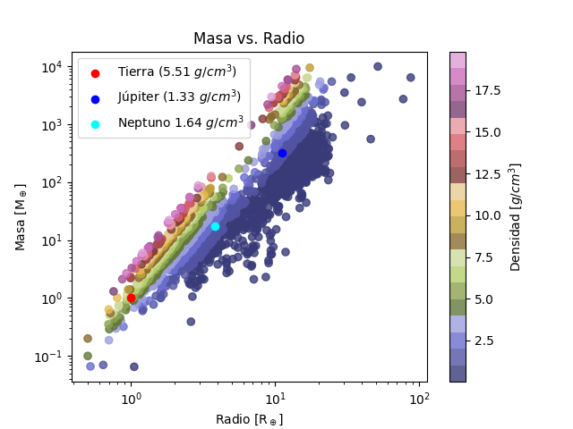

# MD_proyecto_1er_mes - Minería de Datos proyecto primer mes

Este proyecto asume que se tienen las siguientes librerías de python instaladas:
pandas, sqlite3, matplotlib

Además este archivo tiene elementos latex.

# Problema: Transición Planetaria

Graficar Masa vs Radio. Identificar dónde los planetas dejan de ser rocosos densos y pasan a ser gigantes gaseosos esponjosos.

## Análisis de datos:

Los datos obtenidos de la NASA nos trae 3330 datos ya limpios, sobre estos datos se calculó la densidad guardándose en el archivo densidad.csv (ordenado por densidad).
Las masas (M) y radios (R) obtenidos están en términos de masas y radios terrestres. por lo que la densidad nos da la siguiente ecuación:

$$
\rho_p = \rho_{\oplus} \frac{M}{R^3}
$$

Encontrando valores tan extremos como la densidad de KOI-4777.01 con una densidad de 4120.5 g/cm^3. Aunque Cañas et al (2022) redefinió un valor de masa distinto para este planeta $M_p \leq 0.34 M_\oplus$ dando una densidad máxima de 14.12 $g/cm^3$ densides más acorde a un planeta [1]. Sin embargo en la página de la nasa se sigue conservando este valor tan extremo [2]. Ahora bien, el elemento químico más denso que conocemos es el Osmio con una densidad de 22.59 $g/cm^3$ [3], y suponiendo el caso más extremo que sea un planeta monoelemento de osmio, además teniendo en cuenta que la presión gravitacional comprime el interior del planeta y por ende la densidad aumenta con la profundidad, sin embargo un planeta de un solo material no estan probable, además según los estudios los nucleos planetarios se estiman mayormente ricos en hierro, en los trabajos realizados por Rappaport et al (2013) [6], Weiss & Marcy (2014) [7] y Parviainen et al (2024) [8] nos hablan de la densidad y de las relaciones de los planetas rocosos, y que incluso planetas completamente compuestos por hierro tienen tienen límites para determinar su densidad promedio, nos hablan de rangos típicos para planetas rocosos de entre 5 y 10 $ g/cm^3$ de densidad.

Para este trabajo se adoptó un límite superior de densidad media de 20 $ g/cm^3$ como criterio práctico de limpieza de datos. Este valor no representa un límite físico general para exoplanetas, sino una forma para excluir errores probablemente asociados a las observaciones en masa o radio.

## Análisis de resultados

Usando el filtro que se mencionó anteriormente obtenemos la siguiente gráfica. En la gráfica se agregó los Datos de la Tierra, Júpiter y Neptuno para poner una referencia de planetas que conocemos más de cerca.

Se observa que las diferentes densidades se encuentran en gran variedad de masas y radios. Y sabiendo que la densidad es una relación masa/radio, vemos que estas densidades se van distribuyendo de manera lineal en diferentes franjas.
Se observa que el todos los rangos de masa se encuentran tanto planetas gaseosos como rocosos, por lo que es el radio que más nos da mejores proporciónes e información sobre este dato.

Ahora bien, observando en el eje del radio, se observa que entre los radios de 0 hasta 2 radios terrestres la proporción de planetas rocosos es mayor a los gaseosos. A partir de los 2.5 radios terrestres se observa un incremento de planetas mucho menos densos y a partir de este radio la cantidad de estos planetas más gaseosos empieza a aumentar, por el contrario para los planetas rocosos vemos que existe un límite, es decir una disminución importante en la cantidad de planetas rocosos a partir de los 3.5 radios terrestres hasta los 8 radios terrestres, sindo la mayor cantidad de planetas de densiddades bajas, muy bajas al rededor de 1 $g/cm^3$ a partir de este radio. A los 8 radios terrestres vuelven a aparecer objetos con densidades altas hasta un poco menos de los 20 radios terrestres.. Esta curiosidad que se observa en el gráfico de que entre los rangos de 3.5 $R_\oplus$ y 8 $R_\oplus$ radios (y entre $10^2$ $M_\oplus$ y $10^3$ $M_\oplus$) no aparezcan casi planetas rocosos y que después entre los 8 y los casi 20 radios terrestres vuelva a aparecer planetas rocosos. Esto se puede ver de dos formas, existe un límite físico que hace que este rango intermedio no puedan haber planetas rocosos y la segunda forma es que los planetas rocosos que aparecen después de los 8 $R_\oplus$ sea un error en la medición como pasó con los planetas con densidades muy altas. Para abordar la opción correcta tenemos los artículos escrítos por Zeng, L. et al (2016)[4] y Müller, S. et al (2024)[5] quienes hablan sobre los límites en radio que tienen los planetas rocosos, ya que al ir aumentando su radio y su masa se van volviendo más y más densos con núcleos a altísimas presiones, en el trabajo de Zeng et al realizan un trabajo con planetas rocosos basados en el PREM nos dan radios de hasta 1.7 ó 1.8 $R_\oplus$. Por lo que teniendo en cuenta este análisis, y el respaldo de los artículos se puede asumir que los objetos de radios mayores con densidades altas probablemente corresponden a errores en las mediciones de masa o radio, como ya se vio con el caso de los planetas con densidades extremadamente altas. Y según la gráfica los planetas rocosos se pueden encontrar hasta con un radio de entre los 3 a 3.5 $R_\oplus$.

Una vez que se descartan como errores los planetas rocosos en los rangos de 8 a 20 radios terrestres, encontramos que los planetas con radio más grande son de planetas gaseosos. vemos que más allá de los 20 radios terrestres encontramos solo densidades bajas de $3 g/cm^3$ o menos.

## Conclusiones

- Entre mayor es el radio de un planeta es más probable que sea un planeta gaseoso.

- Con el análisis anterior vemos que hay límites más claros en radio que en masa para encontrar planetas rocosos, y según esta gráfica se pueden encontrar hasta radios de aproximadamente 3.5 $R_\oplus$, donde empieza una transición hacia planetas menos densos.

- Mayores a este radio de 3.5 $R_\oplus$ las densidades empiezan caer encontrando mayormente planetas de 1 $g/cm^3$ de densidad

- Se encuentran muy pocos exoplanetas que tengan un radio mayor a los 30 $R_\oplus$ con densidades muy bajas (es decir solo planetas gaseosos) y masas de $6$ x $10^2$ $M_\oplus$ y $10^4$ $M_\oplus$.

## Referencias

[1] Cañas, C. I., Mahadevan, S., Cochran, W. D., Bender, C. F., Feigelson, E. D., Harman, C. E., Kopparapu, R. K., Caceres, G. A., Diddams, S. A., Endl, M., Ford, E. B., Halverson, S., Hearty, F., Jones, S., Kanodia, S., Lin, A. S. J., Metcalf, A. J., Monson, A., Ninan, J. P., Ramsey, L. W., Robertson, P., Roy, A., Schwab, C., & Stefánsson, G. (2022). A hot Mars-sized exoplanet transiting an M dwarf. The Astronomical Journal, 163(1), 3. https://iopscience.iop.org/article/10.3847/1538-3881/ac3088/pdf

[2] NASA Exoplanet Exploration Program. (s. f.). KOI-4777.01. NASA Science. Recuperado el 22 de marzo de 2026, de https://science.nasa.gov/exoplanet-catalog/koi-477701/

[3] Wikipedia contributors. (s. f.). Osmio. Wikipedia, la enciclopedia libre. Recuperado el 23 de marzo de 2026, de https://es.wikipedia.org/wiki/Osmio.

[4] Zeng, L., Sasselov, D. D., & Jacobsen, S. B. (2016). Mass-radius relation for rocky planets based on PREM. The Astrophysical Journal, 819(2), 127. https://iopscience.iop.org/article/10.3847/0004-637X/819/2/127/pdf

[5] Müller, S., Baron, J., Helled, R., Bouchy, F., & Parc, L. (2024). The mass-radius relation of exoplanets revisited. Astronomy & Astrophysics, 686, A296. https://www.aanda.org/articles/aa/pdf/2024/06/aa48690-23.pdf

[6] Rappaport, S., Sanchis-Ojeda, R., Rogers, L. A., Levine, A., & Winn, J. N. (2013). The Roche limit for close-orbiting planets: Minimum density, composition constraints, and application to the 4.2-hour planet KOI 1843.03.
The Astrophysical Journal Letters, 773(1), L15. https://iopscience.iop.org/article/10.1088/2041-8205/773/1/L15/pdf

[7] Weiss, L. M., & Marcy, G. W. (2014). The mass–radius relation for 65 exoplanets smaller than 4 Earth radii. The Astrophysical Journal Letters, 783(1), L6. https://iopscience.iop.org/article/10.1088/2041-8205/783/1/L6/pdf

[8] Parviainen, H., et al. (2024). SPRIGHT: A probabilistic mass–density–radius relation for small exoplanets.
Monthly Notices of the Royal Astronomical Society, 527(3), 5693–5706. https://academic.oup.com/mnras/article/527/3/5693/7420509?login=false
